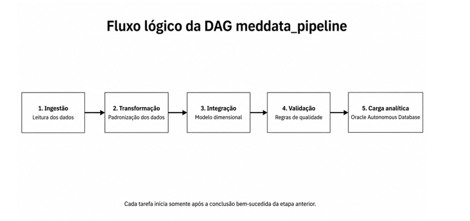
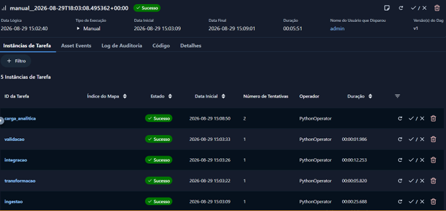
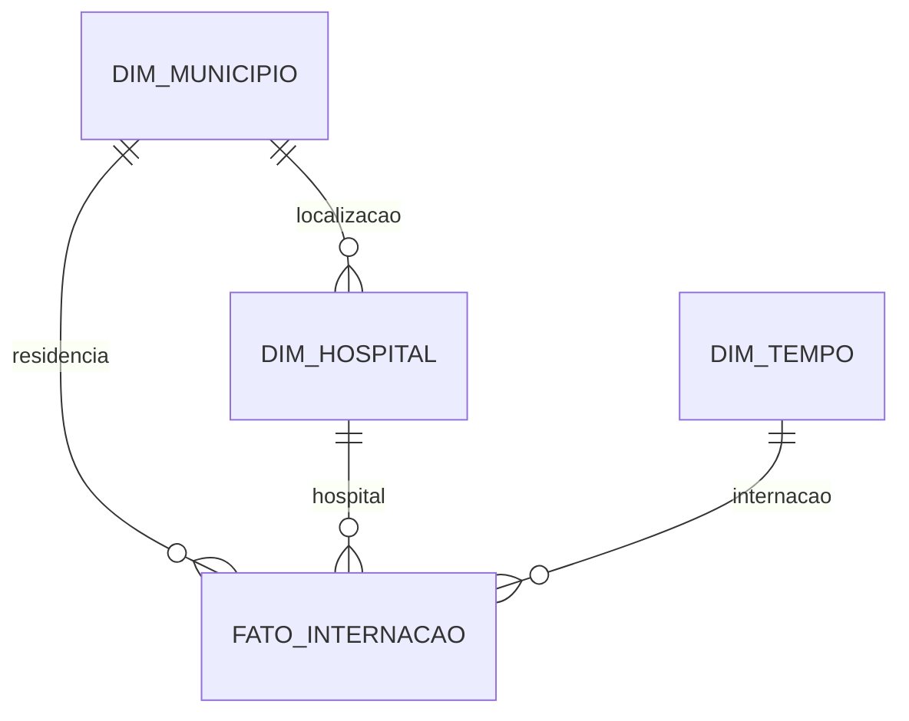

# MedData: pipeline de dados com Apache Airflow

Documentação do projeto e tutorial de utilização. O MedData coleta dados de internações e leitos hospitalares, padroniza as fontes, monta um modelo dimensional, verifica a qualidade e carrega os resultados no Oracle Autonomous Database (ADB).

Este documento descreve o código presente nesta pasta. A configuração atual processa **São Paulo, ano de 2024**, com o mês definido pela data lógica da execução do Airflow. Os exemplos de comandos usam PowerShell, na raiz do projeto.

## Sumário

- [Fluxo do Airflow](#fluxo-do-airflow)
- [Arquitetura e tecnologias](#arquitetura-e-tecnologias)
- [Estrutura do projeto](#estrutura-do-projeto)
- [Etapas do processamento](#etapas-do-processamento)
- [Modelo dimensional](#modelo-dimensional)
- [Arquivos e armazenamento](#arquivos-e-armazenamento)
- [Tutorial de instalação e configuração](#tutorial-de-instalação-e-configuração)
- [Tutorial de execução](#tutorial-de-execução)
- [Uso dos módulos separadamente](#uso-dos-módulos-separadamente)
- [Operação e diagnóstico](#operação-e-diagnóstico)
- [Limitações e manutenção](#limitações-e-manutenção)
- [Referências](#referências)

## Fluxo do Airflow



A imagem fornecida representa a sequência definida em [dags/meddata_pipeline.py](dags/meddata_pipeline.py):

```text
ingestao -> transformacao -> integracao -> validacao -> carga_analitica
```

Cada tarefa depende da conclusão bem-sucedida da anterior. Se uma tarefa falhar definitivamente, as seguintes ficam impedidas de executar pela dependência. Os DataFrames são persistidos em Parquet entre as etapas; os operadores usam `do_xcom_push=False`.

| Configuração | Valor no projeto |
| --- | --- |
| DAG | `meddata_pipeline` |
| Responsável | `meddata` |
| Agendamento | `0 0 5 * *`: dia 5 de cada mês, à meia-noite no fuso do Airflow |
| Data inicial | `2024-01-01` |
| Recuperação automática de períodos anteriores | Desativada: `catchup=False` |
| Execuções simultâneas da DAG | Uma: `max_active_runs=1` |
| Nova tentativa por tarefa | Uma, após cinco minutos |
| Dependência da execução anterior | Desativada: `depends_on_past=False` |
| Operador | `PythonOperator` |

**Data lógica não é necessariamente a data em que a tarefa roda.** O código usa `context["logical_date"].month`, mas mantém `ano=2024` e `uf="SP"`. Consulte a data lógica da execução para identificar o arquivo esperado. Um disparo sem data lógica pode falhar ao acessar `.month`; os exemplos deste tutorial a informam explicitamente.

O projeto não define fuso explicitamente. Consulte o fuso configurado antes de interpretar o horário do cron:

```powershell
docker compose exec airflow airflow config get-value core default_timezone
```

### Execução concluída com sucesso



A captura fornecida registra uma execução manual concluída em 29/08/2026, com duração total de 5 minutos e 51 segundos. O Airflow apresenta o estado **Sucesso** para o fluxo e para todas as tarefas: `ingestao`, `transformacao`, `integracao`, `validacao` e `carga_analitica`.

Embora a interface liste as tarefas em ordem inversa, a sequência de execução segue o fluxo lógico apresentado acima. A carga analítica registra duas tentativas e terminou com sucesso.

## Arquitetura e tecnologias

| Componente | Função |
| --- | --- |
| Docker Compose | Sobe o serviço único `airflow` |
| `apache/airflow:3.2.1-python3.11` | Imagem configurada no Compose |
| `airflow standalone` | Inicializa os componentes locais do Airflow |
| pandas e NumPy | Limpeza, agrupamentos e cálculos |
| PyArrow / Parquet | Persistência dos dados tabulares |
| PySUS | Download de SIH/SUS e CNES |
| SDK `oci` | Envio de arquivos ao OCI Object Storage |
| `oracledb` e Wallet | Conexão com o Autonomous Database |
| `DBMS_CLOUD.COPY_DATA` | Carga dos Parquets do Object Storage em tabelas Oracle existentes |

O Compose instala `pandas`, `pyarrow`, `pysus`, `oci`, `oracledb` e `apache-airflow-providers-oracle` por `_PIP_ADDITIONAL_REQUIREMENTS`. NumPy é importado pelos módulos e chega pelas dependências instaladas. As versões desses pacotes não estão fixadas.

Na DAG atual, ingestão e transformação gravam apenas localmente. A integração grava localmente e envia as quatro tabelas ao bucket `meddata-gold`. A validação lê os arquivos locais. A carga lê os objetos na OCI, e não os Parquets locais.

**O upload Gold acontece antes da validação.** Assim, uma reprovação impede a carga no Oracle, mas os objetos já podem estar no bucket.

## Estrutura do projeto

```text
Airflow-docker/
|-- docker-compose.yaml       # Serviço, dependências, variáveis e volumes
|-- .env                      # Variáveis locais; contém segredos
|-- README.md                 # Esta documentação
|-- dags/
|   `-- meddata_pipeline.py    # Orquestração das cinco tarefas
|-- src/
|   |-- __init__.py
|   |-- config.py             # Diretórios, UF, ano, mês e nomes de arquivos
|   |-- ingestao.py           # SIH, CNES e referência municipal
|   |-- transformacao.py      # Limpeza e padronização
|   |-- integracao.py         # Dimensões, fato e upload Gold
|   |-- validacao.py          # Qualidade e integridade dos dados
|   `-- carga_analitica.py     # Conexão ADB e COPY_DATA
|-- data/
|   |-- raw/                  # SIH e CNES brutos
|   |-- reference/            # Referência municipal
|   `-- processado/           # Fontes tratadas e modelo dimensional
|-- logs/                     # Logs persistidos das tarefas
|-- plugins/                  # Diretório montado, sem plugin próprio atualmente
|-- wallet/                   # Arquivos de conexão Oracle; conteúdo sensível
`-- docs/assets/
    |-- fluxo-meddata-pipeline.png
    `-- execucao-meddata-sucesso.png
```

Há também um arquivo local chamado `login e senha`. Seu conteúdo não é reproduzido aqui e ele não é lido pelos scripts. Não o distribua junto da documentação.

Os diretórios `dags`, `src`, `data`, `logs` e `plugins` são montados em `/opt/airflow/<diretorio>`. A Wallet é montada em `/opt/airflow/wallet`, somente para leitura. A pasta OCI do computador é montada em `/home/airflow/.oci`, também somente para leitura.

## Etapas do processamento

### 1. Ingestão

Implementação: [src/ingestao.py](src/ingestao.py), função `baixar_todos`.

| Fonte | Como é obtida | Conteúdo |
| --- | --- | --- |
| SIH/SUS | `pysus.sih(state, year, month)` | Registros de internação |
| CNES | `pysus.cnes(..., group="LT")` | Leitos hospitalares |
| Referência municipal | CSV do repositório `kelvins/municipios-brasileiros` | Código IBGE, município, UF e coordenadas |

A referência chamada “IBGE” no projeto é obtida de um CSV público no GitHub, não diretamente de uma API oficial do IBGE. O código filtra os municípios pela UF e acrescenta sua sigla.

SIH e CNES leem o primeiro arquivo retornado pelo PySUS (`arquivos[0]`). Os resultados são salvos em Parquet. Uma fonte que retorna `None` faz a tarefa da DAG falhar. Fora da DAG, as funções permitem upload opcional ao bucket `meddata-bronze`.

### 2. Transformação

Implementação: [src/transformacao.py](src/transformacao.py), função `executar_transformacao`.

**SIH:** renomeia campos como `CNES`, `MUNIC_MOV`, `MUNIC_RES`, `DIAG_PRINC`, `DT_INTER`, `DT_SAIDA` e `VAL_TOT`; converte datas no formato `YYYYMMDD`; transforma valores numéricos inválidos em zero; padroniza códigos; remove duplicatas dos campos selecionados e datas de internação inválidas.

Campos derivados:

- `dias_internacao`: diferença entre saída e internação, com ausências e valores negativos convertidos em zero.
- `paciente_viajou`: indica diferença entre município de residência e município da internação.
- `dia_semana`: nome do dia em inglês.
- `tipo_dia`: `Fim de Semana` ou `Dia Util`; não considera feriados.
- `ano_mes`: competência no formato `YYYY-MM` na fonte tratada.

**CNES:** renomeia colunas, converte quantidades de leitos, agrupa pelo hospital e atributos disponíveis e soma leitos totais, SUS e não SUS. Depois mantém um registro por `id_hospital`.

| Porte derivado | Quantidade de leitos |
| --- | --- |
| Micro | Menos de 15 |
| Pequeno | De 15 a 49 |
| Médio | De 50 a 149 |
| Grande | A partir de 150 |

`percentual_sus` é calculado por `leitos_sus / leitos_totais * 100`, limitado ao intervalo de 0 a 100. `alta_complexidade` depende da presença de um valor em `nivel_hierarquico`; é uma regra do script, não uma classificação clínica validada.

**Municípios:** seleciona identificação e coordenadas, acrescenta o nome do estado e reduz o código IBGE aos seis primeiros caracteres para os relacionamentos do projeto. Coordenadas ausentes recebem zero e nomes ausentes recebem `Nao informado`.

### 3. Integração

Implementação: [src/integracao.py](src/integracao.py), função `gerar_star_schema`.

Gera `DIM_MUNICIPIO`, `DIM_HOSPITAL`, `DIM_TEMPO` e `FATO_INTERNACAO`. Municípios de residência que não existem na referência da UF são acrescentados com atributos desconhecidos. Hospitais recebem os atributos geográficos do município. A dimensão de tempo contém as datas de internação encontradas nos dados.

A fato reúne internações, hospital, município do paciente e data. A distância estimada usa Haversine, com raio terrestre de 6.371 km, entre as coordenadas municipais. Não representa trajeto rodoviário nem localização exata do paciente ou hospital. Coordenadas substituídas por zero podem produzir distâncias sem significado geográfico.

Arquivos vazios não são salvos pelo integrador. Na DAG, falha no upload de uma tabela provoca falha da tarefa.

### 4. Validação

Implementação: [src/validacao.py](src/validacao.py), função `executar_validacao`.

| Verificação | Comportamento |
| --- | --- |
| Arquivos ausentes ou tabelas vazias | Reprova |
| Chaves duplicadas | Verifica município, hospital, tempo e internação |
| Integridade referencial | Verifica hospital, tempo e município do paciente na fato |
| Nulos obrigatórios | Verifica campos selecionados nas quatro tabelas |
| Latitude | Deve estar entre -90 e 90 |
| Leitos e dias de internação | Não podem ser negativos |
| Percentual SUS | Deve estar entre 0 e 100 |
| Mais de 50% de nulos em saída ou diagnóstico | Emite aviso, sem reprovar por esse motivo |

O relatório é escrito nos logs. A DAG lança uma exceção quando a função retorna `False`. A validação não é um contrato completo de esquema: algumas verificações só ocorrem quando a coluna existe; outras podem lançar erro por coluna ausente.

### 5. Carga analítica

Implementação: [src/carga_analitica.py](src/carga_analitica.py), função `carregar_star_schema`.

Obtém usuário e senha da conexão Airflow `oracle_adb`, conecta usando Wallet e carrega, nesta ordem:

1. `DIM_MUNICIPIO`.
2. `DIM_HOSPITAL`.
3. `DIM_TEMPO`.
4. `FATO_INTERNACAO`.

Cada tabela usa `DBMS_CLOUD.COPY_DATA` com formato `parquet` e recebe um commit separado. A função tenta as tabelas seguintes mesmo se uma carga falhar; só retorna sucesso quando as quatro forem carregadas.

**A carga pode ser parcial e não é idempotente.** Não há `MERGE`, remoção de período ou limpeza automática. Reexecutar pode duplicar dados ou violar chaves, inclusive na tentativa automática do Airflow. Reconcilie o estado do banco antes de repetir a carga.

## Modelo dimensional



O diagrama representa relacionamentos lógicos dos DataFrames. O projeto não contém DDL que crie essas tabelas ou constraints no Oracle.

| Tabela | Granularidade e chave | Atributos |
| --- | --- | --- |
| `DIM_MUNICIPIO` | Um município por `codigo_municipio` | `nome_municipio`, `uf`, `estado`, `latitude`, `longitude` |
| `DIM_HOSPITAL` | Um hospital por `id_hospital` | Município e coordenadas do hospital; `leitos_totais`, `leitos_sus`, `leitos_nao_sus`, `esfera`, `tipo_unidade`, `nivel_hierarquico`, `natureza_juridica`, `porte_hospitalar`, `alta_complexidade`, `percentual_sus`, quando disponíveis |
| `DIM_TEMPO` | Uma data de internação por `tempo_id` | `data_referencia`, `ano`, `mes`, `trimestre`, `dia_semana`, `ano_mes` |
| `FATO_INTERNACAO` | Um registro tratado remanescente por `internacao_id` | Chaves, diagnóstico, datas, valor, duração, deslocamento e competência |

Na fato, as chaves de relacionamento são `id_hospital`, `codigo_municipio_paciente` e `tempo_id`. Os demais campos previstos são `codigo_diagnostico`, `data_internacao`, `data_saida`, `valor_procedimento`, `dias_internacao`, `paciente_viajou`, `nome_municipio_paciente`, `uf_paciente`, `estado_paciente`, `latitude_paciente`, `longitude_paciente`, `nome_municipio_hospital`, `latitude_hospital`, `longitude_hospital`, `distancia_estimada_km`, `ano_competencia`, `mes_competencia`, `dia_semana` e `tipo_dia`.

`tempo_id` e `internacao_id` são sequências que recomeçam em 1 a cada geração. Portanto, não são identificadores globais entre meses. A fato também não preserva um identificador original de AIH; a deduplicação se baseia nos campos selecionados na transformação.

## Arquivos e armazenamento

Para SP, agosto de 2024, a estrutura esperada é:

```text
data/raw/sih_SP_2024_08.parquet
data/raw/cnes_SP_2024_08.parquet
data/reference/ibge_SP.parquet
data/processado/sih_transformado_SP_2024_08.parquet
data/processado/cnes_transformado_SP_2024_08.parquet
data/processado/ibge_transformado_SP.parquet
data/processado/dim_municipio_SP_2024_08.parquet
data/processado/dim_hospital_SP_2024_08.parquet
data/processado/dim_tempo_SP_2024_08.parquet
data/processado/fato_internacao_SP_2024_08.parquet
```

No bucket Gold, o padrão é:

```text
<tabela>/<UF>/<ANO>/<MES>/<tabela>_<UF>_<ANO>_<MES>.parquet
fato_internacao/SP/2024/08/fato_internacao_SP_2024_08.parquet
```

Os arquivos de referência municipal não têm ano/mês. Uma nova gravação substitui o arquivo da mesma UF. Reprocessar a mesma competência também substitui seus Parquets locais e objetos com o mesmo nome.

## Tutorial de instalação e configuração

### 1. Preparar o ambiente

Tenha Docker Desktop funcionando com containers Linux e Docker Compose disponível. A execução precisa acessar as fontes públicas, o registro de imagens, os pacotes Python e os serviços OCI. O processamento usa DataFrames em memória; dimensione os recursos de acordo com o volume.

```powershell
Set-Location 'C:\Users\ro77d\Documents\Airflow-docker'
docker --version
docker compose version
```

Em outra máquina, substitua o caminho pela pasta onde o projeto foi colocado. Não é necessário instalar Python no Windows para executar pelo container.

### 2. Configurar a Wallet

Extraia a Wallet do seu Autonomous Database para `wallet/`, incluindo os arquivos necessários ao driver, como `tnsnames.ora` e `ewallet.pem`. Preserve os arquivos fornecidos pelo download da Wallet.

Crie ou ajuste a variável no `.env` existente, preservando as demais configurações:

```dotenv
WALLET_PASSWORD=SUA_SENHA_DA_WALLET
```

Essa senha é da Wallet. A senha do usuário Oracle será cadastrada separadamente na conexão `oracle_adb`.

### 3. Configurar OCI Object Storage

O Compose contém um caminho absoluto específico da máquina original:

```yaml
- C:/Users/ro77d/.oci:/home/airflow/.oci:ro
```

Adapte o lado esquerdo ao diretório OCI da sua máquina. Dentro dele, prepare o arquivo `config` e a chave privada correspondente à chave de API cadastrada na OCI. Exemplo sem valores reais:

```ini
[DEFAULT]
user=OCID_DO_USUARIO
fingerprint=FINGERPRINT_DA_CHAVE
tenancy=OCID_DA_TENANCY
region=sa-saopaulo-1
key_file=/home/airflow/.oci/oci_api_key.pem
```

`key_file` precisa apontar para o caminho dentro do container. O SDK usa `from_file()` com o perfil padrão. O usuário precisa de acesso para descobrir o namespace e gravar objetos no bucket `meddata-gold`. O bucket deve existir. `meddata-bronze` só é necessário para os uploads opcionais da ingestão.

Confira também os valores atualmente fixos no código:

| Parâmetro | Valor atual | Local para ajustar |
| --- | --- | --- |
| Alias da Wallet / DSN | `meddata_high` | `tarefa_carga` na DAG |
| Namespace de leitura ADB | `grtrhsatn1p6` | `tarefa_carga` na DAG |
| Credencial no banco | `MEDDATA_CRED` | `tarefa_carga` na DAG |
| Região do endpoint de carga | `sa-saopaulo-1` | `carregar_tabela` em `src/carga_analitica.py` |
| Bucket Gold | `meddata-gold` | Integração e carga analítica |

O upload descobre o namespace pela configuração OCI; a carga usa o namespace fixo passado pela DAG. Ambos devem apontar para os mesmos objetos.

### 4. Preparar o Autonomous Database

No esquema do usuário que fará a carga, prepare as quatro tabelas descritas no modelo dimensional. **Os scripts não criam tabelas e não há um arquivo SQL de provisionamento no projeto.** Os nomes, tipos e mapeamentos precisam ser compatíveis com os Parquets efetivamente gerados. Essa preparação é obrigatória para completar a quinta etapa.

Cadastre a credencial de leitura do Object Storage nesse esquema, usando um usuário OCI com acesso aos objetos e seu auth token. Exemplo para executar no SQL Worksheet do banco, substituindo os marcadores:

```sql
BEGIN
    DBMS_CLOUD.CREATE_CREDENTIAL(
        credential_name => 'MEDDATA_CRED',
        username        => 'USUARIO_OCI',
        password        => 'AUTH_TOKEN_OCI'
    );
END;
/
```

O auth token OCI é distinto da senha do banco, da senha da Wallet e da chave privada usada pelo SDK. O procedimento de carga exige tabela existente e uma credencial com acesso ao objeto. Consulte a [documentação Oracle de credenciais e carga](https://docs.oracle.com/en/cloud/paas/autonomous-database/serverless/adbsb/load-data-cloud-copy.html).

Antes da carga, é possível conferir o provisionamento:

```sql
SELECT table_name
FROM user_tables
WHERE table_name IN ('DIM_MUNICIPIO', 'DIM_HOSPITAL', 'DIM_TEMPO', 'FATO_INTERNACAO');

SELECT credential_name
FROM user_credentials
WHERE credential_name = 'MEDDATA_CRED';
```

### 5. Iniciar o Airflow

```powershell
docker compose config --quiet
docker compose up -d
docker compose ps
docker compose logs --tail 100 airflow
```

Espere a instalação dos pacotes e a inicialização do `standalone`. A interface está em **http://localhost:8080**. Se a porta estiver ocupada, altere a porta à esquerda de `8080:8080` e use a nova porta no navegador.

O Compose não define login e senha fixos para a interface. Para o Simple Auth Manager, consulte as credenciais geradas no ambiente local:

```powershell
docker compose exec airflow airflow config get-value core auth_manager
docker compose exec airflow cat /opt/airflow/simple_auth_manager_passwords.json.generated
```

O segundo comando exibe senhas: use sua saída apenas para entrar no ambiente. Se houver outro gerenciador de autenticação ou caminho personalizado, consulte sua configuração. O caminho padrão é documentado na [referência do Airflow 3.2.1](https://airflow.apache.org/docs/apache-airflow/3.2.1/configurations-ref.html#simple-auth-manager-passwords-file).

### 6. Cadastrar a conexão Oracle no Airflow

Na área administrativa de conexões, quando disponível no gerenciador de autenticação em uso, cadastre:

| Campo | Conteúdo |
| --- | --- |
| Connection ID | `oracle_adb` |
| Connection Type | `Oracle` |
| Login | Usuário do esquema preparado no ADB |
| Password | Senha desse usuário |

A DAG lê somente `login` e `password` dessa conexão. Alterar Host, Schema ou Extra não muda o DSN utilizado; ele continua definido em `tarefa_carga`.

Alternativa pela CLI, substituindo os marcadores, se a conexão ainda não existir:

```powershell
docker compose exec airflow airflow connections add oracle_adb --conn-type oracle --conn-login USUARIO_ADB --conn-password SENHA_ADB
```

Esse comando pode deixar a senha no histórico do terminal. Prefira o formulário administrativo quando disponível ou o mecanismo de segredos adotado no seu ambiente. Não use senhas reais em arquivos de documentação.

## Tutorial de execução

### 1. Conferir o carregamento da DAG

```powershell
docker compose exec airflow airflow dags list
docker compose exec airflow airflow dags list-import-errors
docker compose exec airflow airflow tasks list meddata_pipeline
```

Confirme a DAG `meddata_pipeline`, ausência de erros de importação e as cinco tarefas da imagem.

### 2. Executar uma competência

Após preparar OCI, Wallet, conexão e tabelas, habilite a DAG e dispare uma execução com data lógica explícita. O exemplo processa agosto de 2024:

```powershell
docker compose exec airflow airflow dags unpause meddata_pipeline
docker compose exec airflow airflow dags trigger --logical-date 2024-08-05T00:00:00+00:00 --run-id manual_sp_2024_08 meddata_pipeline
```

Habilitar a DAG também permite seu agendamento automático. O identificador de execução deve ser único; para outro disparo, escolha outro `run-id`, considerando antes os efeitos de reprocessamento no banco. As opções estão na [referência da CLI do Airflow 3.2.1](https://airflow.apache.org/docs/apache-airflow/3.2.1/cli-and-env-variables-ref.html).

Pela interface, abra a DAG, habilite-a e use a ação de disparo. Informe a data lógica quando essa opção estiver disponível; use a CLI acima para controlar a competência explicitamente. O código não lê `dag_run.conf`: fornecer `uf`, `ano` ou `mes` em um JSON de configuração não altera os parâmetros atuais.

### 3. Acompanhar as etapas

Abra a execução na interface e consulte o grafo, os estados das tarefas e seus logs. A sequência esperada é a mesma da imagem. Nos logs, procure os resumos da ingestão, os caminhos dos arquivos, o relatório de validação e a confirmação de carga das quatro tabelas.

```powershell
docker compose exec airflow airflow tasks states-for-dag-run meddata_pipeline manual_sp_2024_08
docker compose logs --tail 200 airflow
Get-ChildItem data/processado
```

### 4. Conferir o resultado

Verifique os quatro Parquets finais, os respectivos objetos no bucket `meddata-gold` e as tabelas Oracle. No SQL Worksheet:

```sql
SELECT 'DIM_MUNICIPIO' AS tabela, COUNT(*) AS registros FROM DIM_MUNICIPIO
UNION ALL
SELECT 'DIM_HOSPITAL', COUNT(*) FROM DIM_HOSPITAL
UNION ALL
SELECT 'DIM_TEMPO', COUNT(*) FROM DIM_TEMPO
UNION ALL
SELECT 'FATO_INTERNACAO', COUNT(*) FROM FATO_INTERNACAO;

SELECT ano_competencia, mes_competencia,
       COUNT(*) AS registros,
       SUM(valor_procedimento) AS valor_total,
       AVG(dias_internacao) AS media_dias
FROM FATO_INTERNACAO
GROUP BY ano_competencia, mes_competencia
ORDER BY ano_competencia, mes_competencia;
```

Contagens no banco podem incluir cargas anteriores. Compare-as com os logs e com a estratégia de carga definida para esse ambiente.

## Uso dos módulos separadamente

Os exemplos abaixo executam dentro do container já iniciado. Ingestão e transformação ainda precisam de internet, mesmo sem upload OCI.

### Apenas ingestão, sem upload

```powershell
docker compose exec airflow python /opt/airflow/src/ingestao.py --uf SP --ano 2024 --mes 8
```

A CLI da ingestão só envia ao bucket Bronze quando recebe `--upload`.

### Transformação, sem upload

```powershell
docker compose exec airflow python /opt/airflow/src/transformacao.py --uf SP --ano 2024 --mes 8 --no-upload
```

Essa CLI baixa novamente as três fontes antes de transformar. Seu upload é habilitado por padrão, por isso o exemplo usa `--no-upload`. A tarefa da DAG, por sua vez, lê os Parquets da ingestão.

### Integração local dos arquivos tratados

`integracao.py` não tem CLI própria. Para gerar o modelo sem enviar à OCI, abra o Python:

```powershell
docker compose exec airflow python
```

Execute no interpretador:

```python
import sys
sys.path.insert(0, "/opt/airflow/src")
import pandas as pd
from config import config
from integracao import gerar_star_schema

tabelas = gerar_star_schema(
    pd.read_parquet(config.PROCESSED_DIR / "sih_transformado_SP_2024_08.parquet"),
    pd.read_parquet(config.PROCESSED_DIR / "cnes_transformado_SP_2024_08.parquet"),
    pd.read_parquet(config.PROCESSED_DIR / "ibge_transformado_SP.parquet"),
    uf="SP", ano=2024, mes=8, salvar=True, upload=False,
)
print({nome: len(df) for nome, df in tabelas.items()})
exit()
```

### Validar os arquivos locais

```powershell
docker compose exec airflow python -c "import sys; sys.path.insert(0, '/opt/airflow/src'); from validacao import executar_validacao; sys.exit(0 if executar_validacao(uf='SP', ano=2024, mes=8) else 1)"
```

`validacao.py` também não possui CLI própria; executar apenas o arquivo não chama `executar_validacao`. O comando acima retorna código zero se aprovado e um se reprovado.

A carga analítica possui CLI, consultável com `python /opt/airflow/src/carga_analitica.py --help` dentro do container. Para o fluxo completo, prefira a DAG, que obtém as credenciais pela conexão Airflow. O nome real do módulo é `carga_analitica.py`, embora seu texto de ajuda ainda mencione `upload_to_adb.py`.

## Operação e diagnóstico

### Comandos frequentes

```powershell
# Suspender novos agendamentos da DAG
docker compose exec airflow airflow dags pause meddata_pipeline

# Parar e retomar o container existente
docker compose stop
docker compose start

# Reiniciar o serviço existente
docker compose restart airflow

# Consultar os logs recentes
docker compose logs --tail 200 airflow
```

Alterações em variáveis do Compose ou no `.env` precisam ser aplicadas com `docker compose up -d`; um simples `restart` não incorpora uma nova configuração de ambiente.

**Persistência:** o Compose monta os arquivos de dados e logs, mas não define volume para o banco de metadados do Airflow ou para todo `/opt/airflow`. Remover ou recriar o container, inclusive com `docker compose down` seguido de `up`, pode perder conexões, histórico e credenciais geradas que ficaram apenas no container. Planeje a persistência antes de recriá-lo.

### Problemas comuns

| Sintoma | O que verificar |
| --- | --- |
| Interface não abre | Docker Desktop, estado do serviço, logs de inicialização e porta 8080 |
| DAG ausente ou importação falha | `dags list-import-errors`, instalação das dependências e volumes `dags`/`src` |
| Erro envolvendo `logical_date` ou `.month` | Disparar com data lógica explícita |
| Download SIH/CNES falha | Rede, disponibilidade da competência e compatibilidade da versão instalada do PySUS |
| Transformação não encontra Parquet | Sucesso da ingestão, UF/ano/mês e nomes em `data/raw` e `data/reference` |
| Integração falha no upload | Montagem `.oci`, perfil `DEFAULT`, caminho da chave no container, permissões e bucket |
| Validação acusa hospital inexistente | Correspondência dos códigos SIH/CNES e hospitais presentes na competência |
| Validação acusa duplicidade ou nulos | Logs da tarefa e campos dos Parquets gerados |
| `WALLET_PASSWORD não foi configurada` | Variável no `.env` e ambiente efetivamente aplicado ao container |
| Alias Oracle não encontrado | `meddata_high` precisa existir em `wallet/tnsnames.ora`, ou a DAG deve usar o alias correto |
| ADB não conecta | Wallet, usuário/senha, acesso de rede e disponibilidade do banco |
| `COPY_DATA` falha | Tabelas, compatibilidade do esquema, credencial, região, namespace e objetos Gold |
| Carga parcialmente concluída | Identificar tabelas já carregadas antes de repetir; há commit por tabela |
| Arquivos locais aprovados, mas carga inesperada | Conferir se o objeto remoto corresponde ao mesmo arquivo validado |

Após corrigir uma falha, use a ação de limpar o estado da tarefa na interface para permitir nova execução, incluindo as dependentes quando necessário. Para `carga_analitica`, verifique primeiro os registros já persistidos no Oracle. Não marque etapas como sucesso para contornar uma reprovação de qualidade.

## Limitações e manutenção

- **Parâmetros da DAG:** UF e ano estão repetidos em chamadas e nomes de arquivos. Alterar apenas `src/config.py` não muda a DAG inteira. Para outro recorte, ajuste todas as referências da DAG de forma consistente.
- **Configuração local:** `MEDDATA_BASE_DIR` muda a raiz de dados em `config.py`, mas o Compose não repassa essa variável atualmente. Os caminhos da Wallet e de importação da DAG continuam fixos em `/opt/airflow`.
- **Histórico mensal:** os IDs reiniciam por execução e não há estratégia incremental ou de atualização de dimensões. Antes de acumular competências no banco, defina chaves estáveis e tratamento de reprocessamento.
- **Qualidade semântica:** a deduplicação pode juntar registros com campos selecionados iguais; códigos convertidos para texto podem mascarar valores ausentes; agrupamentos CNES e posterior deduplicação podem descartar combinações. Interprete os indicadores considerando essas regras.
- **Geografia:** municípios não encontrados usam atributos desconhecidos e coordenadas zero. Não interprete todas as distâncias como deslocamentos válidos.
- **Publicação:** a validação local acontece depois do upload, sem promoção de objetos aprovados nem verificação de igualdade entre arquivo local e remoto.
- **Ambiente:** o Compose usa `standalone`, instala dependências ao iniciar e não define banco externo, healthcheck, backup ou persistência completa de metadados. A configuração precisa ser ampliada antes de uma operação de produção.
- **Segredos:** o Compose contém chaves de serviço em texto. Antes de compartilhá-lo, externalize esses valores; mantenha `.env`, Wallet, chaves OCI e arquivos de senhas fora do versionamento. Nenhum valor secreto foi transcrito nesta documentação.
- **Verificação:** não há suíte de testes automatizados ou DDL de banco nesta pasta. Esta documentação foi revisada contra o código; a criação do documento não executou downloads, uploads nem cargas no Oracle.

## Referências

- [DAG do projeto](dags/meddata_pipeline.py).
- [Configuração dos diretórios e parâmetros](src/config.py).
- [Serviço Docker Compose](docker-compose.yaml).
- [CLI do Apache Airflow 3.2.1](https://airflow.apache.org/docs/apache-airflow/3.2.1/cli-and-env-variables-ref.html).
- [Configuração do Apache Airflow 3.2.1](https://airflow.apache.org/docs/apache-airflow/3.2.1/configurations-ref.html).
- [Oracle: criar credenciais e carregar tabelas existentes](https://docs.oracle.com/en/cloud/paas/autonomous-database/serverless/adbsb/load-data-cloud-copy.html).
- [CSV municipal utilizado pelo código](https://github.com/kelvins/municipios-brasileiros), fonte indicada em `src/ingestao.py`.
